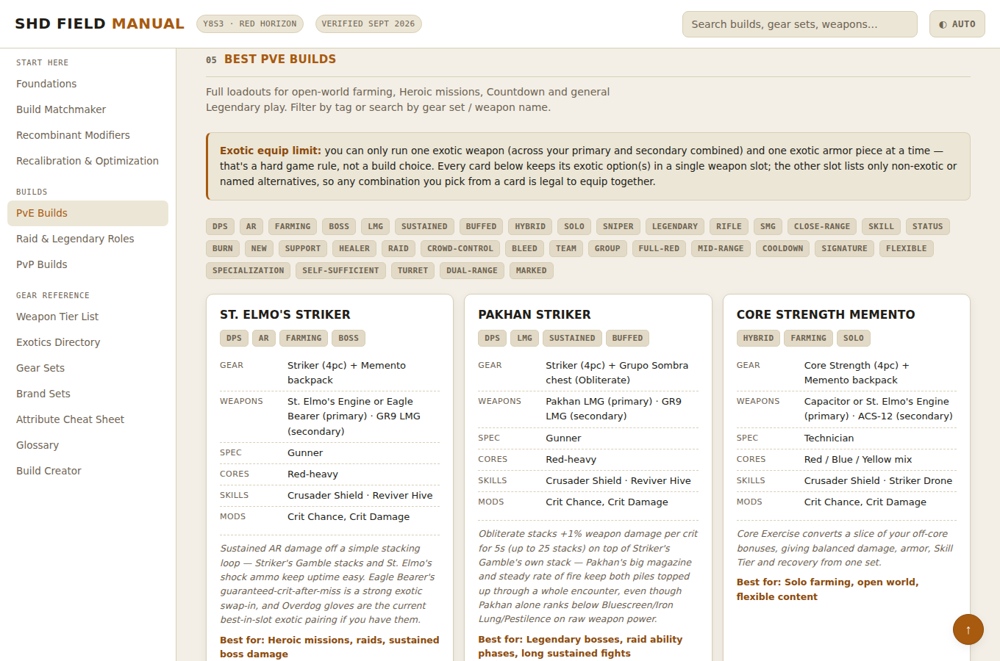

# SHD Field Manual

A comprehensive, interactive Division 2 build reference guide — gear sets, weapons, recalibration workflow, and a build matchmaker. The page itself is a single `index.html` file with no build step and no framework; build cards and glossary terms live in separate JSON files it fetches at load, so they can be edited by hand or through the web-based editor described below.

**🔗 Live site: https://bessv2.github.io/shd-field-manual/**



## What's inside

- **Foundations** — the three core attributes and six specializations everything else is built around
- **Build Matchmaker** — pick a gear set to see its best weapons/skills, or a weapon to see which gear sets are built around it, with every recommendation clickable
- **Global Modifiers, Recalibration & Optimization workflow** — the current season's systems laid out as a strict step-by-step process
- **PvE, Raid/Legendary and PvP build cards** — full loadouts, filterable by tag and searchable by name
- **Weapon tier list, Exotics directory, Gear Sets, Brand Sets, Attribute cheat sheet, Glossary** — reference tables, all wired into the same global search
- **Build Creator** — assemble a custom loadout, save it to your browser, or copy a shareable link
- Talent tooltips, scroll-spy navigation, a light/dark/auto theme toggle, and a responsive layout for mobile

## Running it locally

There's nothing to install or build.

```bash
git clone https://github.com/Bessv2/shd-field-manual.git
cd shd-field-manual
python3 -m http.server 8000   # or: npx serve
```

Then open `http://localhost:8000`. The page fetches `data/cards.json` and `data/glossary.json` at load, so it needs to be served over `http(s)://` — opening `index.html` straight from disk (`file://`) will fail to load the build cards and glossary in most browsers.

## Editing content

Build cards and glossary terms live in [`data/cards.json`](data/cards.json) and [`data/glossary.json`](data/glossary.json) — edit them directly, or use the web editor at **[/admin](https://bessv2.github.io/shd-field-manual/admin/)**, a [Decap CMS](https://decapcms.org/) instance that logs in with your GitHub account and commits changes straight to this repo. `scripts/validate.js` checks both files' shape on every push, so a malformed edit fails CI instead of breaking the live site.

Everything else (weapon tier list, exotics, gear sets, brand sets, glossary categories UI, etc.) is still inline in `index.html`'s `<script>` block — the same JSON + CMS pattern can be extended to those the same way if useful.

<details>
<summary>One-time setup for the `/admin` login (repo owner only)</summary>

Decap CMS needs a GitHub OAuth App and a place to run the OAuth handshake; GitHub Pages can't run that itself, so this uses Netlify's free hosted OAuth proxy — you don't need to move hosting there, just create one (free) Netlify account to register the provider:

1. On GitHub, go to **Settings → Developer settings → OAuth Apps → New OAuth App** and create one with:
   - **Homepage URL:** `https://bessv2.github.io/shd-field-manual/`
   - **Authorization callback URL:** `https://api.netlify.com/auth/done`
2. Sign in to [Netlify](https://app.netlify.com) (any account works, even with no sites deployed) and go to **Team settings → OAuth clients** (formerly "Access control → OAuth" on the old dashboard) → **Install provider** → **GitHub**, and paste in the Client ID and Client Secret from step 1.
3. Visit `https://bessv2.github.io/shd-field-manual/admin/` and click in — it'll pop up a GitHub login/authorize window, then drop you into the Build Cards / Glossary editor.

Only accounts with write access to this repo can actually save changes, so this is safe to leave public.
</details>

## Contributing

This manual aggregates community theorycrafting and is kept current by hand each season. If you spot a stale number, a missing build, or a broken interaction, please [open an issue](https://github.com/Bessv2/shd-field-manual/issues/new/choose) or send a pull request.

## Disclaimer

This manual aggregates community theorycrafting current as of Red Horizon (Y8S3, ~September 2026). The Division 2's balance shifts nearly every season — treat exact percentages, material costs and drop tables as directional and verify against in-game tooltips before farming.

## License

Code in this repository is available under the [MIT License](LICENSE). The Division 2 and all associated names, items, and assets referenced here are property of Ubisoft; this is an unofficial, fan-made reference.
